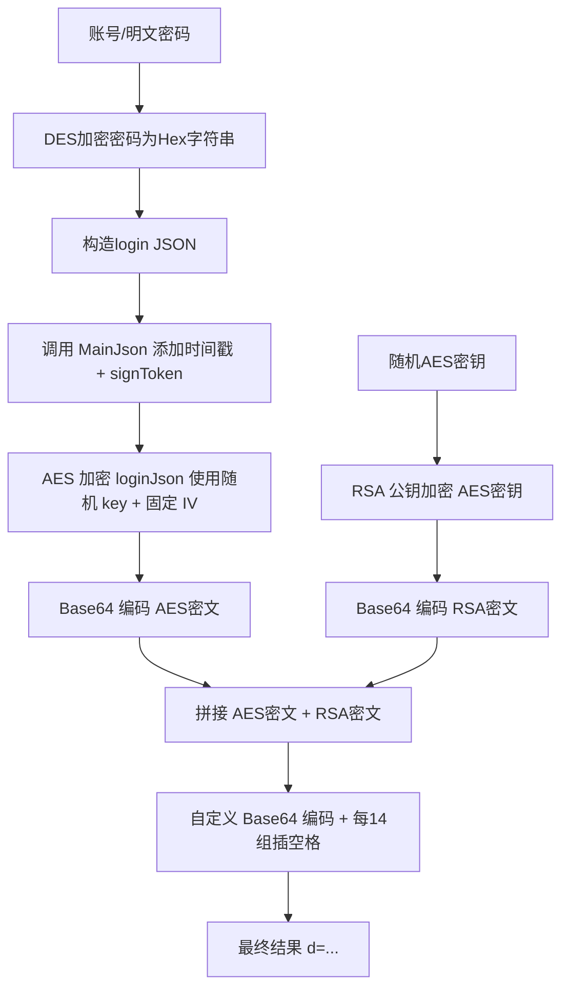

以下是逆向思路,由本人提供思路,CHATGPT总结
---

## 1. JSON 参数构建与密码预处理

- **用户输入**  
  - `EncryptionUtility.inputAccountAndPassword()` 中通过 `Scanner` 读取用户的账号 (`account`) 和明文密码 (`password`)。  
- **密码 DES 加密**  
  - 调用 `ToolFunctions1.getPwd(password)`：  
    1. 用固定 8 字节密钥 `"51434574"` 构建 DES `SecretKeySpec`。  
    2. 用 `Cipher.getInstance("DES/ECB/PKCS5Padding")` 对密码做 DES/ECB/PKCS5Padding 加密。  
    3. 将加密字节数组转成十六进制字符串并转大写返回。  
  - 结果保存在 `EncryptionUtility.encryptedPassword`【turn0file1】。

- **JSON 字符串化**  
  - `EncryptionUtility.buildJsonParameters()` 按模板 `{"account": "...", "pwd": "...", "version": "4.7.1"}` 构造初始业务参数 JSON 字符串，用于后续签名。

---

## 2. 签名生成（`SignToken` 类）

签名的目的是防篡改，流程如下【turn0file0】：

1. **解析 JSON → Map**  
   ```java
   Map<String,String> params = objectMapper.readValue(jsonInput, Map.class);
   ```
2. **添加 timestamp**  
   ```java
   String timestamp = String.valueOf(System.currentTimeMillis());
   params.put("timestamp", timestamp);
   ```  
   确保每次签名的唯一性与时效性。
3. **按键排序**  
   ```java
   TreeMap<String,String> treeMap = new TreeMap<>(params);
   ```  
   保证字段顺序稳定。
4. **JSON 序列化**  
   ```java
   String jsonString = objectMapper.writeValueAsString(treeMap);
   ```
5. **SHA-512 计算**  
   ```java
   byte[] shaHash = MessageDigest.getInstance("SHA-512")
                         .digest(jsonString.getBytes("UTF-8"));
   ```
6. **Hex → 取奇数位 → 再取偶数位**  
   - 方法 `a(byte[])` 将 `shaHash` 转成十六进制串。  
   - `b(hex)` 取所有索引为奇数的字符；再通过 `c(...)` 取结果的偶数位，得到一段新字符串。
7. **MD5 取大写**  
   ```java
   String signToken = MD5(evenChars).toUpperCase();
   ```
8. **将 `signToken` 加入 params 并最终序列化**  
   ```java
   params.put("signToken", signToken);
   return objectMapper.writeValueAsString(new TreeMap<>(params));
   ```

---

## 3. 对称加密：AES / CBC / PKCS5Padding

- **随机生成 AES 密钥**  
  ```java
  String aesKey = ToolFunctions1.generateRandomString(); // 16 字符随机串
  ```
- **固定 IV**  
  - `ToolFunctions2.FIXED_IV_BASE64` 里存着 Base64 编码的 16 字节 IV；解码后构造 `IvParameterSpec`。
- **加密签名后整个 JSON 文本**  
  ```java
  Cipher cipher = Cipher.getInstance("AES/CBC/PKCS5Padding");
  cipher.init(Cipher.ENCRYPT_MODE, new SecretKeySpec(aesKey.getBytes(), "AES"), iv);
  byte[] encrypted = cipher.doFinal(plaintext.getBytes("UTF-8"));
  String aesEncryptedText = Base64.getEncoder().encodeToString(encrypted);
  ```  
  — 返回的是标准 Base64。

---

## 4. 非对称加密：RSA / PKCS1Padding

- **加载公钥**  
  - 从 `ToolFunctions2.PUBLIC_KEY_BASE64` Base64 解码得到 X.509 公钥，构造 `PublicKey` 对象。  
- **RSA 分段加密 AES 密钥**  
  ```java
  Cipher rsa = Cipher.getInstance("RSA/NONE/PKCS1Padding","BC");
  rsa.init(Cipher.ENCRYPT_MODE, publicKey);
  // 分块（117 字节）加密，合并字节数组
  byte[] encryptedKey = rsa.doFinal(aesKey.getBytes("UTF-8"));
  String rsaEncryptedKey = Base64.getEncoder().encodeToString(encryptedKey);
  ```

---

## 5. 混合构造与自定义 Base64

- **拼接**  
  ```java
  String concatenated = aesEncryptedText + rsaEncryptedKey;
  ```
- **自定义 Base64 编码**（`ToolFunctions1.d(byte[])`）  
  - 按每 3 字节一组手动编码到 Base64 字符表，并每 14 组插入一个空格。  
- **生成最终参数**  
  ```java
  String d = "d=" + customBase64(concatenated.getBytes());
  ```

---

## 6. HTTP 请求与应答处理

- **构建表单 POST**  
  ```java
  RequestBody body = RequestBody.create(
      MediaType.parse("application/x-www-form-urlencoded"), d);
  Request req = new Request.Builder()
      .url(apiUrl)
      .post(body)
      .addHeader("content-type","application/x-www-form-urlencoded")
      // … 其它 header …
      .build();
  ```
- **发送**  
  - `OkHttpClient.newCall(req).enqueue(...)`（异步）或 `.execute()`（同步）。  
- **响应解压/GZIP**  
  - 如果 `Content-Encoding: gzip`，用 `GZIPInputStream` 解压后读取。  
- **登录时额外提取 `token`、`uid`** 并复用到后续接口。

---

### 全流程图示

1. **输入** → 账号/明文密码  
2. **密码加密** → DES → 十六进制大写  
3. **构造 JSON** → `{"account","pwd","version"}`  
4. **签名** → +timestamp → 排序 → JSON → SHA-512 → Hex → 奇偶 → MD5 → `signToken`  
5. **AES 加密** → 签名后 JSON → AES/CBC/PKCS5Padding → Base64  
6. **RSA 加密** → AES Key → RSA/PKCS1Padding → Base64  
7. **拼接 & 自定义 Base64** → `aesData + rsaKey` → custom Base64 → `d=`  
8. **POST** → 服务端  
9. **GZIP 解压 & 解析** → 处理结果  
---

## 🔐 1. DES 密码加密（模拟 Java 的 getPwd）

### 函数：
```python
def des_encrypt(plain_text: str) -> str:
    cipher = DES.new(des_key, DES.MODE_ECB)
    padded_data = symmetric_pad(plain_text.encode("utf-8"), DES.block_size)
    encrypted_bytes = cipher.encrypt(padded_data)
    return encrypted_bytes.hex().upper()
```

### 说明：
- 使用 **ECB 模式** 与 `PKCS5Padding`（PyCryptodome 中 `pad` 实际用的是 PKCS7，等价）；
- 密钥为 `"51434574"`，8 字节，固定；
- 输出是 **大写的十六进制字符串**；
- 和 Java 的 `getPwd()` 实现完全一致。

---

## 🧾 2. 构造签名 JSON（调用 Java 版 `SignToken.MainJson`）

```python
from SignToken import MainJson
loginJson = MainJson(json.dumps(login_data))
```

这个步骤是关键！它做了以下事情：
- 加上 `"timestamp"` 字段，使用 Java 风格毫秒时间戳；
- 所有字段排序；
- 计算 SHA-512 → hex → 取奇数位 → 取偶数位 → MD5 → signToken；
- 将 signToken 添加回 JSON，最终返回新的 JSON 字符串。

---

## 🔑 3. 随机 AES 密钥生成

```python
def randomKey():
    return ''.join(random.choice(aes_characters) for _ in range(16))
```

- 生成长度为 **16 字节** 的对称密钥（AES-128）；
- 字符表与 Java 中的字符池完全一致；
- 是加密登录数据的临时密钥。

---

## 🔐 4. AES 加密带签名的 JSON 数据

```python
def aes_encrypt(key: bytes, iv: bytes, plaintext: str) -> bytes:
    padded_data = pad(plaintext.encode('utf-8'))
    cipher = Cipher(algorithms.AES(key), modes.CBC(iv))
    encryptor = cipher.encryptor()
    return base64.b64encode(encryptor.update(padded_data) + encryptor.finalize())
```

- 使用 **AES/CBC/PKCS5Padding**（块大小 16 字节）；
- IV 是固定的，通过 Base64 解析自字符串（Java 固定）；
- 输出：**Base64 编码后的 AES 密文**。

---

## 🔐 5. RSA 加密 AES 密钥

```python
def rsa_encrypt(public_key_der: bytes, plaintext: bytes, chunk_size: int = 117) -> bytes:
    public_key = serialization.load_der_public_key(public_key_der)
    ciphertext = b''
    for i in range(0, len(plaintext), chunk_size):
        chunk = plaintext[i:i + chunk_size]
        ciphertext += public_key.encrypt(chunk, asymmetric_padding.PKCS1v15())
    return base64.b64encode(ciphertext)
```

- RSA 公钥格式为 DER（Base64 解码后）；
- 使用 **PKCS#1 v1.5 填充**；
- 加密后的密钥使用 **Base64 输出**。

---

## 🔧 6. 自定义 Base64 拼接加密内容（`ToolFunctions1.d(...)`）

```python
UnD = Encryptaes + Encryptras
d = "d=" + custom_base64_d(UnD)
```

- 将 AES 密文 + RSA 密钥 拼接为一个完整字节流；
- 使用自定义 Base64 编码逻辑（Java 端同样逻辑）：
  - 每 3 字节一组；
  - 使用 `A-Za-z0-9+/`；
  - 每 14 组插入一个空格；
- 生成最终发送用的参数：`d=...`

---

## ✅ 总结：完整登录加密流程



---

